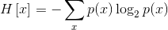
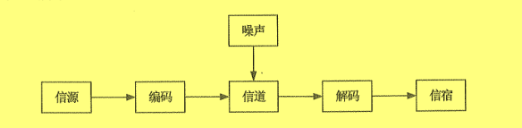

### 1.1信息与信息化
#### 1.1.1信息

1.关于信息的基本概念

信息（information）是客观事物状态和运动特征的一种普遍形式，

维纳（Norbert Wiener）认为：信息就是信息，既不是物质也不是能量。这个论述第-次把信息与物质和能量相提并论。

息论的奠基者香农（Claude E.Shannon）认为：信息就是能够用来消除不确定性的东西。这个论述第--次阐明了信息的功能和用途。

哲学界认为：信息是事物普遍联系的方式。

2.本体论信息概念

事物的本体论信息，就是事物的运动状态和状态变化方式的自我表述。按照这个定义，所谓得到了某个事物的本体论信息，就是知道了这个事物处在什么样的运动状太，以及这个运动状态会按照什么方式发生变化。

3.认识论信息概念

主体关于某个事物的认识论信息，就是主体对于该事物的运动状态以及状态变化方式的具体描述，包括对于它的“状态和方式”的形式、含义和价值的描述。

4.信息的定量描述

香农被称为是“信息论之父”。人们通常将香农于1948 年10月发表的论文《通信的数学理论》（A Mathematical Theory of Communicaio）作为现代信息论研究的开端。

香农用概率来定量描述信息，给出了如下公式：

H（x）表示事件x的信息熵，P：是事件出现第i种状态的概率，在二进制的情况下，对数的底是2，此时信息熵可以作为信息的度量，称为信息量，单位是比特（bit）。

5.信息的传输模型

信息是有价值的一种客观存在。信息技术主要为解决信息的采集、加工、存储、

输、处理、计算、转换、表现等问题而不断繁荣发展。信息只有流动起来，才能体现其价值，因此信息的传输技术（通常指通信、网络等）是信息技术的核心。信息的传输模型如图所示。

（1）信源：产生信息的实体，信息产生后，由这个实体向外传播他通过健盘最入的文学明好题需要化册的信点。中间外好地

（2）信宿：信息的归宿或接受者，如使用QQ的另一-方（当然这一-方也是信源），他透过电脑屏幕接收QQ使用者发送的文字（如：你好！）。

（3）信道：传送信息的通道，如TCPIP网络。信道可以从逻辑上理解为抽象信道，也可以是

是具有物理意义的实际传送通道。TCP/IP风网络是一个逻辑上的概念，这个网络的

物理通道可以是光纤、铜轴电缆、双绞线，也可以是4G网络，至是卫星或者微波。

（4）编码器：在信息论中是泛指所有变换信号的设备，实际上就是终端机的发送部分。它包括从信源到信道的所有设备，如量化器、压缩编码器、调制器等，使信源输出的信号转换成适于信道传送的信号。在QQ应用中，键盘敲击会使键盘由不确定状态转息最终被封装为TCP/IP包，推入TCPIP网络，开始传播之旅。从信息安全的角度出发，编码器还可以包括加密设备，加密设备利用密码学的知识，对编码信息进行加密再编码。

（5）译码器：是编码器的逆变换设备，把信道上送来的信号（原始信息与噪声的叠加）转换成信宿能接受的信号，可包括解调器、译码器、数模转换器等。在上述QQ应用中，TCP/IP包被解析，信息将显示在信宿的电脑屏幕上，发送者传送信息的不确定性

（6）噪声：噪声可以理解为干扰，干扰可以来自于信息系统分层结构的任何一一层，当噪声携带的信息大到一定程度的时候，在信道中传输的信息可以被噪声淹没导致传输当信源和信宿已给定、信道也已选定后，决定信息系统性能就在于编码器和译码器。

概括起来，信息系统的基本规律应包括信息的度量、信源特性和信源编码、检测理论，估计理论以及密码学。

6.信息的质量属性

信息反映的是事物或者事件确定的状态，具有客观性、普遍性等特点，由于获取信息满足了人们消除不确定性的需求，因此信息具有价值，而价值的大小取决于信息的质量，这就要求信息满足一定的质量属性。包括：

（1）精确性，对事物状态描述的精确程度。

（2）完整性，对事物状态描述的全面程度，完整信息应包括所有重要事实。

（3）可靠性，指信息的来源、采集方法、传输过程是可以信任的，符合预期

（4）及时性，指获得信息的时刻与事件发生时刻的间隔长短。昨天的天气信息不论怎样精确、完整，对指导明天的穿衣并无帮助，从这个角度出发，这个信息的价值为零。

（5）经济性，指信息获取、传输带来的成本在可以接受的范围之内。

（6）可验证姓，指信息的主要质量属性可以被证实或者证伪的程度。

（7）安全性，指在信息的生命周期中，信息可以被非授权访问的可能性，可能性越，安全性越高。

#### 1.1.2信息系统

系统的基本概念

系统是指由一系列相互影响、相互联系的若干组成部件，在规则的约束下构成的有机整体，这个整体具有其各个组成部件所没有的新的性质和功能，并可以和其他系统或者外部环境发生交互作用。系统在接受外部信息，并向系统外部输出信息或对外部环境发生作用的过程中所表现出来的效能或者特征，就是系统的功能。

一般而言，系统具有以下几个特点：

（1）目的性。

（2）可嵌套性。

（3）稳定性。

（4）开放性。

（5）脆弱性。

（6）健壮性。

2.信息系统的定义

信息系统是一种以处理信息为目的的专门的系统类型。信息系统可以是手工的，也可以是计算机化的，本书中讨论的信息系统是计算机化的信息系统。信息系统的组成部数据库、网络，存储设备，感知识别、外设、人员以及把数据处理成信息的规程等。

3.信息系统的生命周期

软件在信息系统中属于较复杂的部件，可以借用软件的生命周期来表示信息系生命周期，软件的生命周期通常包括：可行性分析与项目开发计划、需求分析、概要计、详细设计、编码、测试、维护等阶段，信息系统的生命周期可以简化为系统规划（系统实施（编码、测试）、运行维护等阶段，为了便于论述针对信息系统的项目管理，括系统验收等工作。

如果从项目管理的角度来看，项目的生命周期又划分为启动、计划、执行和收尾等4个典型的阶段。

#### 1.1.3信息化

什么是信息化？

所谓信息化在不同的语境中有不同的含义。用作名词，通常指现代信息技术应用，特别是促成应用对象或领域发生转变的过程。例如，“企业信息化”不仅指在企业中应用信息技术，更重要的是通过深入应用信息。

信息化从小到大分层以下五个层次：

（1）产品信息化。

（2）企业信息化。

（3）产业信息化。

（4）国民经济信息化。

（5）社会生活信息化。

信息化的核心是要通过全体社会成员的共同努力，在经济和社会各个领域充分应用基于现代信息技术的先进社会生产工具（表现为各种信息系统或软硬件产品），创建信息时代社会生产力，并推动生产关系和上层建筑的改革（表现为法律、法规、制度、规范、标准、组织架构等），使国家的综合实力，社会的文明素质和人民的生活质量全面提升。

信息化的基本内涵启示我们：信息化的主体是全体社会成员，包括政府、企业、事业、团体和个人：它的时域是一一个长期的过程；它的空城是政治、经济、文化、军事和社会的一切领域；它的手段是基于现代信息技术的先进社会生产工具；它的途径是创建信息时代的社会生产力，推动社会生产关系及社会上层建筑的改革：它的目标是使国家的综合实力、社会的文明素质和人民的生活质量全面提升。

#### 1.1.4国家信息化体系要素

（1）“两网”，是指政务内网和政务外网。

（2）“一站”，是指政府门户网站。

（3）“四库”，即建立人口、法人单位、空间地理和自然资源、宏观经济等四个基础

（4）“十二金”，是指以“金”字冠名的12个重点业务系统。分三类。

**1.信息技术应用**
信息技术应用

是指把信息技术广泛应用于经济和社会各个领域。

**2.信息资源**

信息资源，材料资源和能源共同构成了国民经济和社会发展的三大战略资源。

信息资源与自然资源、物质资源相比，具有以下7个特点:
(1)能够重复使用，其价值在使用中得到体现:
(2)信息资源的利用具有很强的目标导向，不同的信息在不同的用户中体现不同的价值:
(3)具有广泛性。人们对其检索和利用，不受时间、空间、语言、地域和行业的制约：
(4)是社会公共财富，也是商品，可以被交易或者交换；
(5)具有流动性，通过信息网可以快速传输:
(6)多态性，信息资源可以以数字、文字、图像、声音、视频等多种形态存在:
(7)融合性，整合不同的信息资源并分析、挖掘，可以得到新的知识，取得比分散信息资源更高的价值。

**3.信息网络**

信息网络是信息资源开发利用和信息技术应用的基础，是信息传输、交换和共享的必要手段。只有建设先进的信息网络，才能充分发挥信息化的整体效益。

目前，**人们通常将信息网络分为电信网、广播电视网和计算机网**。这3种网络有各自的形成过程、服务对象、发展模式。3种网络的功能有所交叉，又互为补充。

3种网络的发展方向是：互相融通，取长补短，逐步实现三网融合。

从技术上看，三网融合是指电信网、广播电视网、计算机网在向宽带通信网、数字电视网、下一代互联网演进过程中，三大网络通过技术改造，其技术功能趋于一致，业务范围趋于相同，网络互联互通、资源共享，能为用户提供语音、数据和广播电视等多种服务。

三网融合并不意味着三大网络的物理合一，而主要是指高层业务应用的融合。

三网融合应用广泛，遍及智能交通、环境保护、政府工作、公共安全、平安家居等多个领域
**4，信息技术和产业**

信息技术和产业是我国进行信息化建设的基础。
**5.信息化人才**

信息化人才是国家信息化成功之本，对其他各要素的发展速度和质量有着决定性的影响，是信息化建设的关键。

软件和信息技术服务业作为知识和技术密集型产业，其竞争的根本是人才的竞争

信息化人才队伍建设的总体思路是:以能力建设为核心，以高层次人才、复合型人才的培养、选拔和引进为重点，调整人才结构，全面提高人才综合素质。加快培养一支

**6.信息化政策法规和标准规范**

信息化政策法规和标准规范用于规范和协调信息化体系各要素之间关系，是国家信息化快速、持线、有序、健康发展的根本保障。

#### 1.1.5信息技术发展及趋势

信息技术发展趋势和新技术应用主要包括以下10个方面

1.高速度大容量
2.集成化和平台化
3.智能化
4.虚拟计算
5.通信技术
6.遥感和传感技术
7.移动智能终端
8.以人为本信息安全

### 1.2国家信息化战略和规划
#### 1.2.1国家信息化战略目标

#### 1.2.2信息化的指导思想和基本原则

#### 1.2.3我国信息化发展的主要任务和发展重点

### 1.3电子政务
#### 1.3.1电子政务的概念和内容

#### 1.3.2我国电子政务开展的现状

#### 1.3.3电子政务建设的指导思想和发展方针

#### 1.3.4电子政务建设的发展方向和应用重点

### 1.4企业信息化和两化深度融合
#### 1.4.1企业信息化概述

#### 1.4.2企业资源计划

#### 1.4.3客户关系管理

#### 1.4.4供应链管理

#### 1.4.5电子商务

### 1.5商业智能
### 1.6新一代信息技术及应用
#### 1.6.1大数据

#### 1.6.2云计算

#### 1.6.3互联网

#### 1.6.4智慧城市

