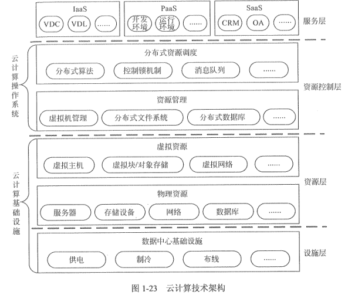
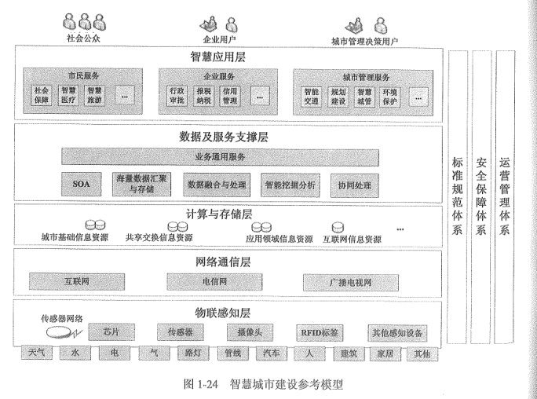

### 1.1信息与信息化
#### 1.1.1信息

1.关于信息的基本概念

信息（information）是客观事物状态和运动特征的一种普遍形式，

维纳（Norbert Wiener）认为：信息就是信息，既不是物质也不是能量。这个论述第-次把信息与物质和能量相提并论。

息论的奠基者香农（Claude E.Shannon）认为：信息就是能够用来消除不确定性的东西。这个论述第--次阐明了信息的功能和用途。

哲学界认为：信息是事物普遍联系的方式。

2.本体论信息概念

事物的本体论信息，就是事物的运动状态和状态变化方式的自我表述。按照这个定义，所谓得到了某个事物的本体论信息，就是知道了这个事物处在什么样的运动状太，以及这个运动状态会按照什么方式发生变化。

3.认识论信息概念

主体关于某个事物的认识论信息，就是主体对于该事物的运动状态以及状态变化方式的具体描述，包括对于它的“状态和方式”的形式、含义和价值的描述。

4.信息的定量描述

香农被称为是“信息论之父”。人们通常将香农于1948 年10月发表的论文《通信的数学理论》（A Mathematical Theory of Communicaio）作为现代信息论研究的开端。

香农用概率来定量描述信息，给出了如下公式：

H（x）表示事件x的信息熵，P：是事件出现第i种状态的概率，在二进制的情况下，对数的底是2，此时信息熵可以作为信息的度量，称为信息量，单位是比特（bit）。

5.信息的传输模型

信息是有价值的一种客观存在。信息技术主要为解决信息的采集、加工、存储、

输、处理、计算、转换、表现等问题而不断繁荣发展。信息只有流动起来，才能体现其价值，因此信息的传输技术（通常指通信、网络等）是信息技术的核心。信息的传输模型如图所示。

（1）信源：产生信息的实体，信息产生后，由这个实体向外传播他通过健盘最入的文学明好题需要化册的信点。中间外好地

（2）信宿：信息的归宿或接受者，如使用QQ的另一-方（当然这一-方也是信源），他透过电脑屏幕接收QQ使用者发送的文字（如：你好！）。

（3）信道：传送信息的通道，如TCPIP网络。信道可以从逻辑上理解为抽象信道，也可以是

是具有物理意义的实际传送通道。TCP/IP风网络是一个逻辑上的概念，这个网络的

物理通道可以是光纤、铜轴电缆、双绞线，也可以是4G网络，至是卫星或者微波。

（4）编码器：在信息论中是泛指所有变换信号的设备，实际上就是终端机的发送部分。它包括从信源到信道的所有设备，如量化器、压缩编码器、调制器等，使信源输出的信号转换成适于信道传送的信号。在QQ应用中，键盘敲击会使键盘由不确定状态转息最终被封装为TCP/IP包，推入TCPIP网络，开始传播之旅。从信息安全的角度出发，编码器还可以包括加密设备，加密设备利用密码学的知识，对编码信息进行加密再编码。

（5）译码器：是编码器的逆变换设备，把信道上送来的信号（原始信息与噪声的叠加）转换成信宿能接受的信号，可包括解调器、译码器、数模转换器等。在上述QQ应用中，TCP/IP包被解析，信息将显示在信宿的电脑屏幕上，发送者传送信息的不确定性

（6）噪声：噪声可以理解为干扰，干扰可以来自于信息系统分层结构的任何一一层，当噪声携带的信息大到一定程度的时候，在信道中传输的信息可以被噪声淹没导致传输当信源和信宿已给定、信道也已选定后，决定信息系统性能就在于编码器和译码器。

概括起来，信息系统的基本规律应包括信息的度量、信源特性和信源编码、检测理论，估计理论以及密码学。

6.信息的质量属性

信息反映的是事物或者事件确定的状态，具有客观性、普遍性等特点，由于获取信息满足了人们消除不确定性的需求，因此信息具有价值，而价值的大小取决于信息的质量，这就要求信息满足一定的质量属性。包括：

（1）精确性，对事物状态描述的精确程度。

（2）完整性，对事物状态描述的全面程度，完整信息应包括所有重要事实。

（3）可靠性，指信息的来源、采集方法、传输过程是可以信任的，符合预期

（4）及时性，指获得信息的时刻与事件发生时刻的间隔长短。昨天的天气信息不论怎样精确、完整，对指导明天的穿衣并无帮助，从这个角度出发，这个信息的价值为零。

（5）经济性，指信息获取、传输带来的成本在可以接受的范围之内。

（6）可验证姓，指信息的主要质量属性可以被证实或者证伪的程度。

（7）安全性，指在信息的生命周期中，信息可以被非授权访问的可能性，可能性越，安全性越高。

#### 1.1.2信息系统

系统的基本概念

系统是指由一系列相互影响、相互联系的若干组成部件，在规则的约束下构成的有机整体，这个整体具有其各个组成部件所没有的新的性质和功能，并可以和其他系统或者外部环境发生交互作用。系统在接受外部信息，并向系统外部输出信息或对外部环境发生作用的过程中所表现出来的效能或者特征，就是系统的功能。

一般而言，系统具有以下几个特点：

（1）目的性。

（2）可嵌套性。

（3）稳定性。

（4）开放性。

（5）脆弱性。

（6）健壮性。

2.信息系统的定义

信息系统是一种以处理信息为目的的专门的系统类型。信息系统可以是手工的，也可以是计算机化的，本书中讨论的信息系统是计算机化的信息系统。信息系统的组成部数据库、网络，存储设备，感知识别、外设、人员以及把数据处理成信息的规程等。

3.信息系统的生命周期

软件在信息系统中属于较复杂的部件，可以借用软件的生命周期来表示信息系生命周期，软件的生命周期通常包括：可行性分析与项目开发计划、需求分析、概要计、详细设计、编码、测试、维护等阶段，信息系统的生命周期可以简化为系统规划（系统实施（编码、测试）、运行维护等阶段，为了便于论述针对信息系统的项目管理，括系统验收等工作。

如果从项目管理的角度来看，项目的生命周期又划分为启动、计划、执行和收尾等4个典型的阶段。

#### 1.1.3信息化

什么是信息化？

所谓信息化在不同的语境中有不同的含义。用作名词，通常指现代信息技术应用，特别是促成应用对象或领域发生转变的过程。例如，“企业信息化”不仅指在企业中应用信息技术，更重要的是通过深入应用信息。

信息化从小到大分层以下五个层次：

（1）产品信息化。

（2）企业信息化。

（3）产业信息化。

（4）国民经济信息化。

（5）社会生活信息化。

信息化的核心是要通过全体社会成员的共同努力，在经济和社会各个领域充分应用基于现代信息技术的先进社会生产工具（表现为各种信息系统或软硬件产品），创建信息时代社会生产力，并推动生产关系和上层建筑的改革（表现为法律、法规、制度、规范、标准、组织架构等），使国家的综合实力，社会的文明素质和人民的生活质量全面提升。

信息化的基本内涵启示我们：信息化的主体是全体社会成员，包括政府、企业、事业、团体和个人：它的时域是一一个长期的过程；它的空城是政治、经济、文化、军事和社会的一切领域；它的手段是基于现代信息技术的先进社会生产工具；它的途径是创建信息时代的社会生产力，推动社会生产关系及社会上层建筑的改革：它的目标是使国家的综合实力、社会的文明素质和人民的生活质量全面提升。

#### 1.1.4国家信息化体系要素

（1）“两网”，是指政务内网和政务外网。

（2）“一站”，是指政府门户网站。

（3）“四库”，即建立人口、法人单位、空间地理和自然资源、宏观经济等四个基础

（4）“十二金”，是指以“金”字冠名的12个重点业务系统。分三类。

**1.信息技术应用**
信息技术应用

是指把信息技术广泛应用于经济和社会各个领域。

**2.信息资源**

信息资源，材料资源和能源共同构成了国民经济和社会发展的三大战略资源。

信息资源与自然资源、物质资源相比，具有以下7个特点:
(1)能够重复使用，其价值在使用中得到体现:
(2)信息资源的利用具有很强的目标导向，不同的信息在不同的用户中体现不同的价值:
(3)具有广泛性。人们对其检索和利用，不受时间、空间、语言、地域和行业的制约：
(4)是社会公共财富，也是商品，可以被交易或者交换；
(5)具有流动性，通过信息网可以快速传输:
(6)多态性，信息资源可以以数字、文字、图像、声音、视频等多种形态存在:
(7)融合性，整合不同的信息资源并分析、挖掘，可以得到新的知识，取得比分散信息资源更高的价值。

**3.信息网络**

信息网络是信息资源开发利用和信息技术应用的基础，是信息传输、交换和共享的必要手段。只有建设先进的信息网络，才能充分发挥信息化的整体效益。

目前，**人们通常将信息网络分为电信网、广播电视网和计算机网**。这3种网络有各自的形成过程、服务对象、发展模式。3种网络的功能有所交叉，又互为补充。

3种网络的发展方向是：互相融通，取长补短，逐步实现三网融合。

从技术上看，三网融合是指电信网、广播电视网、计算机网在向宽带通信网、数字电视网、下一代互联网演进过程中，三大网络通过技术改造，其技术功能趋于一致，业务范围趋于相同，网络互联互通、资源共享，能为用户提供语音、数据和广播电视等多种服务。

三网融合并不意味着三大网络的物理合一，而主要是指高层业务应用的融合。

三网融合应用广泛，遍及智能交通、环境保护、政府工作、公共安全、平安家居等多个领域
**4，信息技术和产业**

信息技术和产业是我国进行信息化建设的基础。
**5.信息化人才**

信息化人才是国家信息化成功之本，对其他各要素的发展速度和质量有着决定性的影响，是信息化建设的关键。

软件和信息技术服务业作为知识和技术密集型产业，其竞争的根本是人才的竞争

信息化人才队伍建设的总体思路是:以能力建设为核心，以高层次人才、复合型人才的培养、选拔和引进为重点，调整人才结构，全面提高人才综合素质。加快培养一支

**6.信息化政策法规和标准规范**

信息化政策法规和标准规范用于规范和协调信息化体系各要素之间关系，是国家信息化快速、持线、有序、健康发展的根本保障。

#### 1.1.5信息技术发展及趋势

信息技术发展趋势和新技术应用主要包括以下10个方面

1.高速度大容量
2.集成化和平台化
3.智能化
4.虚拟计算
5.通信技术
6.遥感和传感技术
7.移动智能终端
8.以人为本
9.信息安全
10.两网融合

### 1.2国家信息化战略和规划
#### 1.2.1国家信息化战略目标

(1)促进经济增长方式的根本转变。

(2)实现信息技术自主创新、信息产业发展的跨越。

(3)提升网络普及水平、信息资源开发利用水平和信息安全保障水平。

(4)增强政府公共服务能力、社会主义先进文化传播能力、中国特色的军事变革能力和国民信息技术应用能力。

#### 1.2.2信息化的指导思想和基本原则

1.指导思想

我国信息化发展的指导思想是:以邓小平理论、“三个代表”重要思想和科学发展观为指导，把加快信息化建设作为促进发展方式转变的重要途径，把扩大信息技术应用作为构建现代产业体系的重大举措，把提高信息服务能力作为保障和改善民生的有力支撑。加强统筹规划，坚持科学发展，以企业为主体，以市场为导向，积极推进下一代信息基础设施建设，推动信息化与工业化深度融合，着力突破技术和产业瓶颈，切实增强信息安全保障能力，大幅提升信息化水平，为促进经济社会持续发展作出贡献。

2.基本原则

(1)统筹发展，有序推进。

(2)需求牵引，市场导向。

(3)完善机制，创新驱动。

(4)加强管理，保障安全。

#### 1.2.3我国信息化发展的主要任务和发展重点

1.促进工业领域信息化深度应用

2.加快推进服务业信息化

3.积极提高中小企业信息化应用水平

4.协力推进农业农村信息化

5.全面深化电子政务应用

6.稳步提高社会事业信息化水平

7.统筹城镇化与信息化互动发展

8.加强信息资源开发利用

9.构建下一代国家综合信息基础设施

10.促进重要领域基础设施智能化改造升级

11.着力提高国民信息能力

12.加强网络与信息安全保障体系建设

### 1.3电子政务
#### 1.3.1电子政务的概念和内容

1.电子政务的概念电子政务是指政府机构在其管理和服务职能中运用现代信息技术，实现政府组织结构和工作流程的重组优化，超越时间、空间和部门分隔的制约，建成一个精简、高效、廉洁、公平的政府运作模式。电子政务模型可简单概括为两方面:政府部门内部利用先进的网络信息技术实现办公自动化、管理信息化、决策科学化；政府部门与社会各界利用网络信息平台充分进行信息共享与服务、加强群众监督、提高办事效率及促进政务公开，等等。

2.电子政务的内容

​    (1)政府间的电子政务(G2G)。
​    (2)政府对企业的电子政务(G2B)。
​    (3)政府对公众的电子政务(G2C)。
​    (4)政府对公务员(G2E)。

#### 1.3.2我国电子政务开展的现状

#### 1.3.3电子政务建设的指导思想和发展方针

1.指导思想我国电子政务建设的指导思想是:以邓小平理论和“三个代表”重要思想为指导，深入贯彻落实科学发展观，紧紧围绕全面建设小康社会的总目标，以电子政务科学发展为主题，以深化应用和注重成效为主线，转变电子政务发展方式，充分发挥电子政务应用成效，服务经济结构战略性调整，服务保障和改善民生，服务加强和创新社会管理，促进服务型政府、责任政府、法治政府和廉洁政府建设，走一条立足国情、讲求实效、面向未来的电子政务发展道路。

(1)必须坚持将科学发展观贯穿电子政务发展全过程。

(2)必须坚持把以人为本和构建和谐社会作为电子政务发展的出发点和落脚点。

(3)必须坚持把深化应用和突出成效作为电子政务发展的根本要求。

(4)必须坚持创新发展和加强管理的有机统一。

#### 1.3.4电子政务建设的发展方向和应用重点

1.加快推动重要政务应用发展

(1)推进部门业务应用发展。

(2推进部门业务应用发展。

(3)强化政府网站应用服务。

2.加强保障和改善民生应用

  (1 )深化保障和改善民生应用。
（2)加强县级政府和基层政务服务应用。

3.加强创新社会管理应用

（1）深化社会管理应用。

（2）促进城镇社会管理创新

4.强化政务信息资源开发利用

（1）建设高质量政务信息资源。

（2）加强政府信息资源管理。

（3）大力推动信息共享和政务信息资源社会化利用。

5.建设完善电子政务公共平台

(1)完成以云计算为基础的电子政务公共平台顶层设计

(2)全面提升电子政务技术服务能力

(3)制定电子政务云计算标准规范

(4)鼓励向云计算模式迁移

6.提高政府信息系统的信息安全保障能力

 (1)建设完善信息安全保障体系。

 (2)定电子政务安全可靠的标准规就。

(3)进一步加强政府信息系统安全管理

### 1.4企业信息化和两化深度融合
#### 1.4.1企业信息化概述

企业信息化是产业升级转型的重要举措之一,而以“两化深度融合”“智能制造”“互联网+”为特点的产业信息化是未来企业信息化继续发展的方向。大力推进企业信息化对于我国信息化建设,促进“十三五”期间国民经济发展,具有十分重要的现实意义和历史意义企业信息化就是用现代信息技术来实现企业经营战略、行为规范和业务流程。企业信息化大大拓宽了企业活动的时空范围,在时间上,企业信息化以客户需求为中心实施敏捷衔造;在空间上,企业信息化以虚拟形态将全球聚合在荧屏上。真正实现了运筹帷幄之中,决胜千里之外。

1.企业信息化内涵

(1)企业信息化结构

产品（服务）层

作业层

管理层

决策层

（2）企业信息化概念

概括地说:企业信息化就是:“在企业作业、管理、决策的各个层面,科学计算、过程控制、事务处理、经营管理的各个领域,引进和使用现代信息技术,全面改革管理体制和机制,从而大幅度提高企业工作效率、市场竞争能力和经济效益。”

从两化融合到中国制造2025企业信息化发展之路。

#### 1.4.2企业资源计划

#### 1.4.3客户关系管理

I.CRM 概述

1)企业关系管理在介绍客户关系管理概念之前，本段先引入企业关系管理概念，并且勾画出企业关系管理与客户关系管理两者之间关系。
2)客户关系管理的构成和定义本段先介绍 CRM概念的三个要点——客户、关系以及管理，然后给出客户关系管理的定义。

(1)客户

CRM 中的C代表的含义是客户，是指企业产品或者服务所面对的对象，既包括去商场购物而最终获取企业产品的常规意义上的那类顾客，也包括了很多企业级的客户、分销商和相关事业单位等。客户按照不同的标准可以划分成为不同的类型。

(2)关系

关系(relationship) 字面的意义是指两个个体之间，或者组织之间，或者组织与个体之间的某种性质的联系，包括一方对另外一方的感觉以及一方行为对另外一方所产生的影响。在CRM 中，关系专门针对企业和客户之间的联系，包括企业行为对客户产生

(3)管理

管理(management)， 字面上是指对资源的有效控制和分配，以实现最优的资源配和最高的团队工作效率。在CRM 中，管理的对象是客户与企业之间的双向关系，使得这种关系可以最大程度地帮助企业实现他所确定的经营目标。在企业对其客户关系行管理的过程中，必须注意的是:首先，这种双向关系的建立有个自己的生命周期，

(4) CRM的概念和定义

对 CRM 的三个要素有了认识之后，现在来看一下什么是企业客户关系管理。目前比较主流的CRM定义为:CRM系统是基于方法学、软件和因特网的以有组织的方式帮助企业管理客户关系的信息系统。

2.CRM的体系结构

1) CRM三角模型

2) CRM的结构和功能

crm系统的体系结构

（2）crm系统的功能

1.有一个统一的以客户为中心的数据库

2.有整合各种客户联系渠道的能力。

3.能够提供销售、客户服务和营销三个业务的自动化工具，并且在这三者之间实现通信接口，使得其中一项业务模块的事件可以触发另外一个业务模块中的响应。

4.具备从大量数据中提取有用信息的能力，即这个系统必须实现基本的数据挖掘模块，从而使其具有一定的商业智能。

5.系统应该具有良好的可扩展性和可复用性，即可以实现与其他相应的企业应用系统之间的无缝整合。

3.CRM应用设计

（1）CRM应用设计基础

1.客户数据的有效采集和消费

****

什么是客户数据

  什么是客户数据客户数据可以分为描述性、促销性和交易性数据三大类。
   1.关于描述性数据:这类数据是客户的基本信息，如果是个人客户，一定要涵盖客户的姓名、年龄、ID和联系方式等；如果是企业客户，一定要涵盖企业的名称、规模、联系人和法人代表等。
    2.关于促销性数据:这类数据是体现企业曾经为客户提供的产品和服务的历史数据，主要包括用户产品使用情况调查的数据、促销活动记录数据、客服人员的建议数据和广告数据等。
    3.关于交易性数据:这类数据是反映客户对企业做出的回馈的数据，包括历史购买记录数据、投诉数据、请求提供咨询及其他服务的相关数据、客户建议数据等。

如何有效地采集客户数据

 企业为了全方位地了解并且掌握客户的动态，有效地通过多个渠道获取客户信息显得尤为重要。获取客户信息的主要方式如下。
    1.客户自身会通过诸如电子邮件、电话和传真等多种方式向企业提供数据。
    2.企业还可以通过分布在企业内部的各个部门、员工以及 ERP系统等渠道获得前面所提到的促销性和交易性数据。
    3.社会大环境也是企业不可忽视的一个获取客户信息的来源，例如各种媒体对客户的相关报道，客户关系网向企业直接或者间接提供的数据等。

CRM应用设计特点

可伸缩性

可移植性

CRM应用功能的设计

（1）自动化销售

（2）自动化的市场营销

（3）自动化的客户服务

#### 1.4.4供应链管理

1.供应链管理~(Supply Chain Management,SCM)概述

2.供应链管理的设计

1)供应链系统设计的原则

(1)自顶向下和自底向上相结合的设计原则

(2)简洁性原则

(3)取长补短原则

敏捷供应链管理

(1)敏捷供应链的概念

(2)敏捷供应链的体系结构

#### 1.4.5电子商务

1.4.5 电子商务

1.电子商务的概念对于电子商务至今尚无统一定义。根据电子商务发展历程，电子商务概念可分为原始电子商务与现代电子商务。

(1)原始电子商务概念使用电子信息技术工具进行商务活动。凡使用了诸如电报、电话、广播、电视、传真以及计算机、计算机网络等手段、工具和技术进行商务活动，都可以称之为电子商务。

 (2)现代电子商务概念电子商务通常是指在网络环境下，买卖双方不需见面，实现网上(线上)交易、在线支付(或者货到付款入、智能配送以及相关综合服务的一切活动，是完全创新的或者在一定程度上模拟传统商务流程的一种以信息化手段应用为典型特征的商业运营模式。

2.电子商务的功能电子商务应该具有以下基本特征:
    .普遍性。电子商务作为一种新型的交易方式，将生产企业、流通企业、消费者以及金融企业和监管者集成到了数字化的网络经济中。
    便利性。参与电子商务的各方不受地域、环境、交易时间的限制，能以非常简洁的方式完成传统上较为繁杂的商务活动。
    整体性。电子商务能够规范事务处理的工作流程，将人工操作和电子信息处理集成为一个不可分割的整体，保证交易过程的规范和严谨。
    安全性。与传统的商务活动不同，电子商务必须采取诸如加密、身份认证、防入侵、数字签名、防病毒等技术手段确保交易活动的安全性。
    协调性。商务活动本身是一种磋商、协调的过程，客户与企业之间、企业与企业之间、客户与金融服务部门之间、企业与金融服务部门之间、企业与配送部门之间等需要有序地协作，共同配合来完成交易。
    

3.电子商务系统的结构和要点

电子商务不仅包括信息技术，还包括交易规则、法律法规和各种技术规范。
    

4.电子商务的类型按照依托网络类型来划分，电子商务分为EDI(电子数据交换)商务、Intemet （互联网)商务、Intranet (企业内部网)商务和 Extranet （企业外部网)商务。

按照交易对象，电子商务模式包括：

企业与企业之间的电子商务：B2B

商业企业与消费者之间的电子商务：B2C

消费者与消费者之间的电子商务：C2C

线上购买线下的商品和服务：O2O ,online to offline

5.电子商务对国民经济和社会发展的意义和作用

1.推动国民经济增长方式转变

2.迎接经济全球化的机遇和挑战

3.促进社会注意市场经济体制走向完善

6.我国电子商务现状和特点

7.加快电子商务发展的指导思想和基本原则

1.加快电子商务发展的指导思想

2.加快电子商务发展的基本原则

8.建立和完善电子商户发展的支撑保障体系

1.法律法规体系

2.标准规范体系

3.安全认证体系

4.信用体系

5.在线支付体系

6.现代物流体系

7.技术装备体系

8.服务体系

9.运行监控体系

9.发展电子商务重点任务

1.提高大型企业电子商务水平

2.推动中小企业普及电子商务

3.促进重点行业电子商务发展

4.推动网络零售规模化发展

5.提高政府采购电子商务水平

6.促进跨境电子商务协同发展

7.持续推进移动电子商务发展

8.促进电子商务支撑体系协调发展

9.提高电子商务的安全保障和技术支撑能力

### 1.5商业智能

1.商业智能基本概念

商业智能(Business Intelligence, BI)通常被理解为将组织中现有的数据转化为知识，帮助组织做出明智的业务经营决策。这里所谈的数据包括来自组织业务系统的订单、库存、交易账目、客户和供应商等方面的数据，来自组织所处行业和竞争对手的数据以及来自组织所处的其他外部环境中的各种数据。而商业智能能够辅助组织的业务经营决策，既可以是操作层的，也可以是战术层和战略层的决策。为了将数据转化为知识，需要利用数据仓库、联机分析处理(On-Line Analytics Process, OLAP)工具和数据挖等技术。因此，从技术层面上讲，商业智能不是什么新技术，它只是数据仓库、OLAP和数据挖掘等技术的综合运用。

2.商业智能系统应具有的主要功能

(1)数据仓库:高效的数据存储和访问方式。提供结构化和非结构化的数据存储，容量大，运行稳定，维护成本低，支持元数据管理，支持多种结构，例如中心式数据仓库和分布式数据仓库等。存储介质能够支持近线式和二级存储器，能够很好地支持容灾和备份方案。
(2)数据ETL:数据ETL 支持多平台、多数据存储格式(多数据源、多格式数据文件、多维数据库等)的数据组织，要求能自动地根据描述或者规则进行数据查找和理解。
佩少海重、复汆数据与全局决策效据之间的差距。帮助形成文择尖策要的参考内容。
(3)数据统计输出(报表):报表能快速地完成数据统计的设计和展示，其中包括了统计数据表样式和统计图展示，可以很好地输出给其他应用程序或者以Html 形式表现和保存。对于自定义设计部分要提供简单易用的设计方案，支持灵活的数据填报和针对非技术人员设计的解决方案。能自动地完成输出内容的发布。
(4)分析功能:可以通过业务规则形成分析内容，并且展示样式丰富，具有一定的交互要求，例如预警或者趋势分析等。要支持多维度的 OLAP，实现维度变化、旋转、数据切片和数据钻取等，以帮助做出正确的判断和决策

3.商业智能的三个层次

商业智能的实现有三个层次:数据报表、多维数据分析和数据挖掘。

1.数据报表

2.多维数据分析

3.数据挖掘

4.商业智能的软件工具集合

1.终端用户查询和报告工具

2.数据仓库和数据集市产品

3.数据挖掘软件

4.OLAP工具

​    1.OLAP概念

​     2.“维”的概念

​     3.OLAP的实现方法

5.实施商业智能的步骤

1.需求分析

2.数据仓库建模

3.数据抽取

4.建立商业智能分析报表

5.用户培训和数据模拟测试

6.系统改进和完善

### 1.6新一代信息技术及应用
#### 1.6.1大数据

1.大数据的概念：是指无法在可承受的时间范围内用常规软件工具进行捕捉、管理和处理的数据集合，是需要采用心处理模式才能获取很多智能的，深入的，有价值的信息，以取得到更强的决策力，洞察力和流程优化能力的海量，高增长率和多样化的信息资源。

大数据具有5V特点：

Volume（大量）

Velocity(高速)

Variety(多样)

value（价值）

Veracity(真实性)

2.大数据关键技术

（1）大数据存储管理技术

（2）大数据并行分析技术

（3）大数据分析技术

3.大数据的应用领域

（1）互联网行业应用

（2）传统领域的应用

4.大数据发展应用的目标

（1）打造精准治理，多方协作的社会治理新模式

（2）建立运行平稳，安全高效的经济运行新机制

（3）构建以人为本、惠及全民的民生服务新体系

（4）开启大众创业，万众创新的创新驱动新格局

（5）培育高端智能、新兴繁荣的产业发展新生态

5.大数据发展应用的主要任务

（1）加快政府数据开放共享，推动资源整合，提升治理能力

​        1.大力推动政府部门数据共享。

​        2.稳步推动公共数据资源开放。

​        3.统筹规划大数据基础设施建设。

​       4.支持宏观调控科学化。

​       5.推动政府治理精准化。

​       6.推进商事服务便捷化。  

​       7.促进安全保障高效化。

​       8.加快民生服务普惠化。

（2）推动产业创新发展，培育新兴业态，助力经济转型

​        1.发展工业大数据

​         2.发展新兴产业大数据

​         3.发展农业农村大数据

​         4.发展万众创新大数据

​         5.推进基础研究和核心技术攻关。

​         6.形成大数据产品体系。

​         7.完善大数据产业链。

（3）强化安全保障，提高管理水平，促进健康发展

​       1.健全大数据安全保障体系。

​      2.强化安全支撑。

  

#### 1.6.2云计算

1.云计算概念

云计算（cloud Computing),是一种基于互联网的计算方式，通过这种方式，在网络上配置为共享的软件资源，计算资源，存储资源和信息资源可以按需求提供给网上终端设备和终端用户。所谓“云”是一种抽象的比喻，表示用网络包裹服务或者资源而隐蔽服务或资源共享的实现细节以及资源位置的一种状态。云计算是继大型机-终端计算模式转变为客户端-服务器计算模式的之后的又一种计算模式的转变。在这种模式下，用户不再需要了解“云”中基础设置的细节，也不必具有相应的专业知识，更无序直接进行控制，可以将信息系统的运行维护完全交给“云”平台的管理者。云计算通常通过互联网来提供动态易扩展而且经常是虚拟化的资源，并且计算能力也可作为一种资源通过互联网流通。

云计算的主要特点包括：

1.是宽带网络连接，用户需要通过宽带网络接入“云”中并获得有关的服务，“云”内节点之间也通过内部的高速网络相连。

2.是快速，按需，弹性的服务，用户可以按照实际需求迅速获取或释放资源，并可以根据需求对资源进行动态扩展。

2.云计算服务的类型按照云计算服务提供的资源层次，

可以分为IaaS、PaaS 和 SaaS等三种服务类型。
    (1) laaS（基础设施即服务)，向用户提供计算机能力、存储空间等基础设施方面的服务。这种服务模式需要较大的基础设施投入和长期运营管理经验，但IaaS服务单纯出租资源，盈利能力有限。
    (2) PaaS(平台即服务)，向用户提供虚拟的操作系统、数据库管理系统、Web应用等平台化的服务。PaaS服务的重点不在于直接的经济效益，而更注重构建和形成紧密的产业生态。
    (3)SaaS(软件即服务)，向用户提供应用软件(如 CRM、办公软件等)、组件、工作流等虚拟化软件的服务，SaaS一般采用Web技术和 SOA架构，通过 Internet 向用户提供多租户、可定制的应用能力，大大缩短了软件产业的渠道链条，减少了软件升级、定制和运行维护的复杂程度，并使软件提供商从软件产品的生产者转变为应用服务的运营者。

3.云计算关键技术云计算技术架构包括云计算基础设施和云计算操作系统，其中云计算基础设施由数据中心基础设施和信息网络存储资源组成，云计算操作系统负责调度、管理和控制相关资源，支持对外提供IaaS、PaaS、 SaaS 等服务。

1.基础设置关键技术

云计算基础设置关机技术包括服务器，网络和数据中心相关技术。

2.操作系统关键技术

云计算操作系统的主要关键技术包括资源池管理技术和向用户提供大规模存储，计算能力的分布式任务和数据管理技术。

资源池管理技术主要实现对物理资源，虚拟资源的统一管理，并根据用户需求实现虚拟资源的自动化生成、分配和迁移。当局部物理主机发生故障或需要进行维护时，运行在此主机上的虚拟机应该可以动态地迁移到其他物理主机（即“热迁移”技术），并保证用户业务连续。

分布式任务管理技术实现基于大规模硬件资源上的分布式海量计算，并支持对结构化与非结构化的数据进行存储与管理。

4.发展云计算的指导思想、基本原则和发展目标

1.指导思想

适应推进新型工业化、信息化、城镇化、农业现代化和国家治理能力现代化的需要，以全面深化改革为动力，以提升能力、深化应用为主线，完善发展环境，培育骨干企业，创新服务模式，扩展应用领域，强化技术支撑，保障信息安全，优化设施布局，促进云计算创新发展，培育信息产业新业态，使信息资源得到高效利用，为促进创业兴业、释放创新活力提供有力支持，为经济社会持续健康发展注入新的动力。

 2)基本原则

(1)市场主导。发挥市场在资源配置中的决定性作用，完善市场准入制度，减少行政干预，鼓励企业根据市场需求丰富服务种类，提升服务能力，对接应用市场。建立公平开放透明的市场规则，完善监管政策，维护良好市场秩序。
(2)统筹协调。以需求为牵引，加强分类指导，推进重点领域的应用、服务和产品协同发展。引导地方根据实际需求合理确定云计算发展定位，避免政府资金盲目投资建设数据中心和相关园区。加强信息技术资源整合，避免行业信息化系统成为信息孤岛。
优化云计算基础设施布局，促进区域协调发展。
(3)创新驱动。以企业为主体，加强产学研用合作，强化云计算关键技术和服务模式创新，提升自主创新能力。积极探索加强国际合作，推动云计算开放式创新和国际化发展。加强管理创新，鼓励新业态发展。
(4)保障安全。在现有信息安全保障体系基础上，结合云计算特点完善相关信息安全制度，强化安全管理和数据隐私保护，增强安全技术支撑和服务能力，建立健全安全防护体系，切实保障云计算信息安全。充分运用云计算的大数据处理能力，带动相关安全技术和服务发展。

3.发展目标

到 2017年，云计算在重点领域的应用得到深化，产业链条基本健全，初步形成安全保障有力，服务创新、技术创新和管理创新协同推进的云计算发展格局，带动相关产业快速发展。

1.服务能力大幅提升。

2.创新能力明显增强。

3.应用示范成效显著。

4.基础设施不断优化。

5.安全保障基本健全。

到2020年，云计算应用基本普及，云计算服务能力达到国际先进水平，掌握云计算关键技术，形成若干具有较强国际竞争力的云计算骨干企业。云计算信息安全监管体系和法规体系健全。大数据挖掘分析能力显著提升。云计算成为我国信息化重要形态和建设网络强国的重要支撑，推动经济社会各领域信息化水平大幅提高。

5.发展云计算的主要任务

（1）增强云计算服务能力

（2）提升云计算自主创新能力

（3）探索电子政务云计算发展新模式

（4）加强大数据开发与利用

（5）统筹布局云计算基础设施

（6）提升安全保障能力

#### 1.6.3互联网

1.“互联网+”是经济发展的新形式

“互联网+"是互联网思维的进一步实践成果，它代表一种先进的生产力，推动经济形态不断的发生演变。从而带动社会经济实体的生命力，为改革，创新，发展提供广阔的网络平台。

”互联网+“是把互联网的创新成果与经济社会各领域深度融合，推动技术进步；效率提升和组织变革，提升实体经济创新力和生产力。形成更广泛的以互联网为基础设施和创新要素的经济社会发展新形态。

通俗来说，”互联网+“就是”互联网+各个传统行业“，但这并不是简单的两者相加，而是利用信息通信技术以及互联网平台，让互联网与传统行业进行深度融合，创造新的发展生态。

积极发挥我国互联网已经形成的比较优势，把握机遇，增强信心，加快推进“互联网+”发展，有利于重塑创新体系、激发创新活力、培育新兴业态和创新公共服务模式，对打造大众创业、万众创新和增加公共产品、公共服务“双引擎”，主动适应和引领经济发展新常态，形成经济发展新动能，实现中国经济提质增效升级具有重要意义。

2.”互联网+“行动

1)总体思路

顺应世界“互联网+”发展趋势，充分发挥我国互联网的规模优势和应用优势，推动互联网由消费领域向生产领域拓展，加速提升产业发展水平，增强各行业创新能力，构筑经济社会发展新优势和新动能。坚持改革创新和市场需求导向，突出企业的主体作用，大力拓展互联网与经济社会各领域融合的广度和深度。着力深化体制机制改革，释放发展潜力和活力:着力做优存量，推动经济提质增效和转型升级:着力做大增量，培育新兴业态，打造新的增长点:着力创新政府服务模式，夯实网络发展基础，营造安全网络环境，提升公共服务水平。

2）基本原则

(1)坚持开放共享。营造开放包容的发展环境，将互联网作为生产生活要素共享的重要平台，最大限度优化资源配置，加快形成以开放、共享为特征的经济社会运行新模式。
(2)坚持融合创新。鼓励传统产业树立互联网思维，积极与“互联网+”相结合。
 推动互联网向经济社会各领域加速渗透，以融合促创新，最大程度汇聚各类市场要素的创新力量，推动融合性新兴产业成为经济发展新动力和新支柱。
 (3)坚持变革转型。充分发挥互联网在促进产业升级以及信息化和工业化深度融合中的平台作用，引导要素资源向实体经济集聚，推动生产方式和发展模式变革。创新网络化公共服务模式，大幅提升公共服务能力。
 (4)坚持引领跨越。巩固提升我国互联网发展优势，加强重点领域前瞻性布局，以互联网融合创新为突破口，培育壮大新兴产业，引领新一轮科技革命和产业变革，实现跨越式发展。
 (5)坚持安全有序。完善互联网融合标准规范和法律法规，增强安全意识，强化安全管理和防护，保障网络安全。建立科学有效的市场监管方式，促进市场有序发展，保护公平竞争，防止形成行业垄断和市场壁垒。

3）发展目标

到 2018年，互联网与经济社会各领域的融合发展进一步深化，基于互联网的新业态成为新的经济增长动力，互联网支撑大众创业、万众创新的作用进一步增强，互联网成为提供公共服务的重要手段，网络经济与实体经济协同互动的发展格局基本形成。
(1)经济发展进一步提质增效。互联网在促进制造业、农业、能源、环保等产业转型升级方面取得积极成效，劳动生产率进一步提高。基于互联网的新兴业态不断涌现，电子商务、互联网金融快速发展，对经济提质增效的促进作用更加凸显。
(2)社会服务进一步便捷警惠。健康医疗、教育、交通等民生领域互联网应用更加丰富，公共服务更加多元，线上线下结合史加紧密。社会服务资源配置不断优化，公众享受到更加公平、高效、优质、便捷的服务。
 (3)基础支撑进一步夯实提升。网络设施和产业基础得到有效巩固加强，应用支撑和安全保障能力明显增强。固定宽带网络、新一代移动通信网和下一代互联网加快发展，物联网、云计算等新型基础设施更加完备。人工智能等技术及其产业化能力显著增强。
 (4)发展环境进一步开放包容。全社会对互联网融合创新的认识不断深入，互联网融合发展面临的体制机制障碍有效破除，公共数据资源开放取得实质性进展，相关标准规范、信用体系和法律法规逐步完善。
 到2025年，网络化、智能化、服务化、协同化的“互联网+”产业生态体系基本完善，“互联网+”新经济形态初步形成，“互联网+”成为经济社会创新发展的重要驱动力量。

#### 1.6.4智慧城市

1.智慧城市的内涵和意义

国际电工委员会（IEC)对智慧城市的定义是：智慧城市是城市发展的新理念，是推动政府智能转变、推进社会管理创新的新方法，目标是使基础设施更加智能、公共服务更加便捷，社会管理更加精细、生态环境更加宜居、产业体系更加优化。

2.智慧城市参考模型

智慧城市建设主要包括以下几个部分：

首先，通过传感器或信息采集设备全方位地获取城市系统数据；

其次，通过网络将城市数据关联、融合、处理、分析为信息；

第三，通过充分共享、智能挖掘信息变成知识；

最后，结合信息技术，把知识应用到各行各业形成智慧。

智慧城市建设参考模型包括有依赖关系的5层和对建设有约束关系的3个支撑体系。

    1。功能层
    (1)物联感知层:提供对城市环境的智能感知能力，通过各种信息采集设备、各类传感器、监控摄像机、GPS 终端等实现对城市范围内的基础设施、大气环境、交通、公共安全等方面信息采集、识别和监测。
    (2)通信网络层:广泛互联，以互联网、电信网、广播电视网以及传输介质为光纤的城市专用网作为骨干传输网络，以覆盖全城的无线网络(如 WiFi)、移动4G为主要接入网，组成网络通信基础设施。
    （3）计算与存储层：包括软件资源、计算资源和存储资源，为智慧城市提供数据存储和计算，保障上层对于数据汇聚的相关需求。
    (4)数据及服务支撑层:利用SOA(面向服务的体系架构)、云计算、大数据等技术，通过数据和服务的融合，支撑承载智慧应用层中的相关应用，提供应用所需的各种服务和共享资源。
    (5)智慧应用层:各种基于行业或领域的智慧应用及应用整合，如智慧交通、智慧家政、智慧园区、智慧社区、智慧政务、智慧旅游、智慧环保等，为社会公众、企业、城市管理者等提供整体的信息化应用和服务。
    2)支撑体系
    (1)安全保障体系:为智慧城市建设构建统- -的安全平台，实现统-入口、 统一认.
    证、统一授权、日志记录服务。
    (2)建设和运营管理体系:为智慧城市建设提供整体的运维管理机制，确保智慧城市整体建设管理和可持续运行。
    (3)标准规范体系:标准规范体系用于指导和支撑我国各地城市信息化用户、各行业智慧应用信息系统的总体规划和工程建设,同时规范和引导我国智慧城市相关IT产业的发展，为智慧城市建设、管理和运行维护提供统- -规范， 便于互联、共享、互操作和扩展。
3.智慧城市建设的指导思想，基本原则和主要目标

1.指导思想

按照走集约、智能、绿色、低碳的新型城镇化道路的总体要求，发挥市场在资源配置中的决定性作用，加强和完善政府引导，统筹物质、信息和智力资源，推动新一代信息技术创新应用，加强城市管理和服务体系智能化建设，积极发展民生服务智慧应用，强化网络安全保障，有效提高城市综合承载能力和居民幸福感受，促进城镇化发展质量和水平全面提升。

2.基本原则

（1）以人为本，务实推进。

（2）因地制宜，科学有序。

（3）市场为主，协同创新。

（4）可管可控，确保安全。

3.主要目标

到2020 年，建成一批特色鲜明的智慧城市，聚集和辐射带动作用大幅增强，综合竞争优势明显提高，在保障和改善民生服务、创新社会管理、维护网络安全等方面取得显著成效。

1.公共服务便捷化。

2.城市管理精细化。

3.生活环境宜居化。

4.基础设施智能化。

5.网络安全长效化。

4.智慧城市建设的关键

1.科学制定智慧城市建设顶层设计

（1）加强顶层设计。

（2）推动构建普惠化公共服务体系。

（3）支撑建立精细化社会管理体系。

（4）促进宜居化生活环境建设。

（5）建立现代化产业发展体系。

（6）加快建设智能化基础设施。

2.切实加大信息资源开发共享力度

（1）加快推进信息资源共享与更新。

（2）深化重点领域信息资源开发利用。

3.积极运用新技术新业态

（1）加快重点领域物联网应用

（2）促进云计算和大数据健康发展

（3）推动信息技术集成应用

4.着力加强网络信息安全管理和能力建设

（1）严格全流程网络安全管理

（2）加强要害信息设施和信息资源安全防护

（3）强化安全责任和安全意识

5.智慧城市典型应用

（1）公用事业智能化。

（2）城市智能交通。

（3）城市应急联动。

  