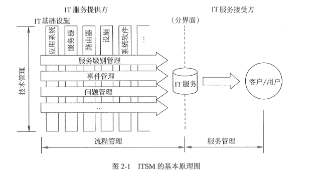
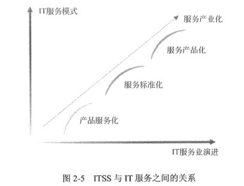

### 2.1信息系统集成及服务管理体系
#### 2.1.1信息系统集成及服务管理的内容

信息系统集成及服务是一个范围相当广泛的概念，所有以满足企业和机构的业务发展所带来的信息化需求为目的，基于信息技术和信息化理念而提供的专业信息技术咨询服务、系统集成服务、技术支持服务、运行维护服务等工作，都属于信息系统集成及服务的范畴。其中信息技术咨询服务是信息系统集成及服务的前端环节，为企业提供信息化建设规划和解决方案。而根据信息化建设方案选择合适的软硬件产品搭建信息化平台，根据企业的业务流程和管理要求进行软件和应用开发，以及系统建成后的长期维护和升级换代等，属于信息系统集成及服务的中间及下游环节，是信息系统集成及服务在不同时期、不同阶段的具体表现，覆盖了各行各业信息化建设的全过程。

问题：

    在我国的信息化建设过程中，信息系统集成及服务存在诸多问题，普遍存在的主要问题如下:
    (1)系统质量不能满足应用的基本需求；
    (2)工程进度拖后延期;
    (3)项目资金使用不合理或严重超出预算；
    (4)项目文档不全甚至严重缺失:
    (5)在项目实施过程中系统业务需求一变再变:
    (6)在项目实施过程中经常出现扯皮、推诿现象；(7)系统存在着安全漏洞和隐患:
    (8)重硬件轻软件，重开发轻维护，重建设轻应用:
    (9)信息系统服务企业缺乏规范的流程和能力管理:
    (10)信息系统建设普遍存在产品化与个性化需求的矛盾:
    (11)开放性要求高，而标准和规范更新快。
原因：

    究其原因，自然要具体问题具体分析，而且不同项目之间也往往存在着差异，但概括起来，主要有以下5点:
    (1)不具备技术实力的系统集成商搅乱信息系统集成及服务市场;
    (2)一些建设单位在选择项目承建商和进行业务需求分析方面经验不足;
    (3)信息系统集成及服务企业自身建设有待加强；
    (4)缺乏相应的机制和制度:
    (5)企业能力建设缺乏相关的指导标准。
措施：

为了保证信息系统工程项目投资、质量、进度及效果各方面处于良好的可控状态，在针对出现的问题不断采取相应措施的探索过程中，逐步形成了**中国特色的信息系统集成及服务管理体系**，主要内容如下:
(1)信息系统集成、运维服务和信息系统监理资质管理:
(2)信息系统集成、运维服务和信息系统监理相关人员管理;
(3)国家计划(投资)部门对规范的、具备信息系统项目管理能力的企业和人员的建议性要求;
(4)信息系统用户对规范的、具备信息系统项目管理能力的企业和人员市场性需求。

**在市场经济条件下，政府主管部门的作用是加强“引导、规范、监管、服务”**，而信息系统集成及服务工程的突出特点是投资和风险都很巨大，因此政府主管部门对其进行合理规范与监管显得尤为重要。但是，我们也清醒地认识到这些制度需要与时俱进，同时也要考虑发挥市场经济中市场的力量，因此，研究与探讨国际上IT治理与管理的先进经验，规范信息化建设市场的秩序，保证信息系统集成及服务工程的质量，降低风险，提高信息系统集成及服务的效率与效益，培育高素质的中介服务机构和从业人员，是加快推进我国信息化建设步伐的一项重要工作。政府主管部门也在不断探索，逐步引入和推行如信息技术服务标准（ITSS)评估、IT服务管理体系 (ITSMS)认证、信息安全管理体系(ISMS)认证、ΠT审计、IT洽理等制度。

#### 2.1.2信息系统集成及服务管理的推进

1.实施信息系统集成及服务资质管理制度

​    1)推荐优秀系统集成商

​     2)对信息系统集成企业进行资质认证

    信息系统集成及服务资质认证工作开展以来，成绩显著，影响巨大，主要表现在以下几个方面。
    (1)认证工作及结果被各级政府和社会各界广泛认同
    (2)资质认证过程中要对企业的软件开发和系统集成的人员队伍、环境设备、质保体系、客服体系、培训体系、软件成果及所占比例、注册资本及财务状况、营业规模及业绩、项目质量、单位信誉等各方面进行严格审查，还要进行每年一次年度数据填报和每四年进行一次换证等检查。这一方面使系统集成企业受到严格的社会监督，另一方面也使得企业的综合实力和素质有了显著提高。
    (3)有效地规范了信息系统集成市场，使皮包商钻空子和搅乱市场秩序的状况得到控制。
    (4)信息系统工程质量显著提高。
    (5)对于广大用户为支持软件与系统集成业发展创造良好环境起到引导作用。例如，过去普遍重视硬件轻视软件，现在逐步提高了对软件价值、系统集成价值和运行维护价值的认识。

2.推行项目经理制度

    《项目经理管理办法》首先界定了此处所指的项目经理的含义，指出:计算机信息系统集成项目经理是指从事计算机信息系统集成业务的企、事业单位法定代表人在计算机信息系统集成项目中的代表人，是受系统集成企、事业单位法定代表人委托对系统集成项目全面负责的项目管理者。
    《项目经理管理办法》将系统集成项目经理分为项目经理、高级项目经理两个级别，并且分别列出了这两个级别的评定条件。
    《项目经理管理办法》对系统集成项目经理的职责和职业范围提出了明确要求，对其资质的申请及审批流程做出了明确规定，并且就系统集成项目经理的监督管理做出了较为详细的具体规定。

3.推出ITSS标准及评估服务

### 2.2信息系统集成及服务资质管理
#### 2.2.1信息系统集成及服务资质管理的必要性和意义

必要性：

第一个问题是：是用户在选择集成商的时候缺少依据和标准，特别是在重大项目招标和实施过程中，缺少必要的监督、检查:此外，有些重大工程项目中的一些流程，包括软件、程序、存档材料，缺少标准，也比较乱，也给项目中软件升级方面造成不少困难。

第二个问题是：由于国家信息系统工程建设要求参与竞标的企业有资质和业绩，而我们当时还没有给企业确认资质等级，所以相当多的企业在参与国际竞争中有困难。

第三个问题是:少数不具备承建信息系统工程能力的单位甚至个人，搅乱市场秩序，破坏“游戏规则”，通过各种各样关系，采用不正当手段，拿到了项目，又不能很好完成这些项目，信息工程完成之日，也是这个项目死亡之时，没有很好发挥作用，为国家和用户部门造成极大经济损失，产生了很坏的社会影响。

意义：

    资质认证工作至少有如下意义:
    (1)有利于系统集成及服务企业展示自身实力，参与市场竞争:按照等级条件，加强自身建设。
    (2)有利于规范信息系统集成及服务市场。
    (3)有利于保证信息系统及服务工程质量。
#### 2.2.2信息系统集成及服务资质管理办法

1.工作机构

电子联合会设立信息系统集成资质工作委员会(以下称电子联合会资质工作委员会)，负责协调、管理资质认定工作，对资质认定结果进行审定.

2.资质设定

信息系统集成及服务资质是对企业从事信息系统集成及服务综合能力和水平的客观评价，集成资质分为一级、二级、三级和四级四个等级，其中一级最高。

3.资质申请与认定

    申请资质认定的企业(以下称申请企业)应具备下列基本条件:
    (1)是在中华人民共和国境内注册的企业法人;
    (2)能够提供与资质等级评定条件相关的证明材料:
    (3)承诺并遵守行业公约,并认同《信息系统集成及服务资质认定管理办法(暂行)》。
    认定。。。
4.资质证书管理

资质证书有效期四年，分为正本和副本，正本和副本具有同等效力。在资质证书有效期内，持证企业每年应按时向电子联合会资质办提交年度数据信息，不能按时提交年度数据信息的企业，视为其自动放弃资质证书。在资质证书有效期期满前，持证企业应按时完成换证申报认定，未按时完成换证申报认定的企业，其资质证书视为自动失效。

#### 2.2.3信息系统集成资质等级条件

1.综合条件

​      综合条件从企业的从业年限、获取低一级资质年数、主业是否为系统集成、注册资金等基本情况来衡量。注册资金数目在一定程度上反映了企业的经济实力和承担风险的能力。不同级别要求注册资金大小的差异，表明高级别资质能力更强。

2.财务状况

         系统集成企业要求财务状况良好。如果企业近三年中连续两年亏损，或虽只有一年亏损，但损额较大则反映其财务状况不佳。
    注意，企业的财务状况应由有资质的审计机构提供的财务数据说明，或以其他方式证明企业所提供的财务数据是可信的。
3.信誉

4.业绩

​       业绩要求主要从企业近三年完成的系统集成项目额、项目规模、项目的技术含量、项目的软件费用比例、项目的实施质量、企业所完成项目在主要业务领域的水平等方面衡量。

5.管理能力

​     1.质量管理体系

​     2.客户服务管理

6.技术实力

​     1.业务领域

​     2.软件开发能力

7.人才实力

​     各级别的人才实力要求主要从工程技术人员、本科以上人员比例、项目经理数目、培训体系和人力资源管理水平等方面衡量。项目经理数量是最能体现企业对系统集成项目实施和管理能力的指标。

### 2.3ITIL与IT服务管理、ITSS与信息技术服务、信息系统审计
#### 2.3.1ITIL与IT服务管理

2.3.1 YTIL与I服务管理

1.ITIL的概念及其发展

1) ITIL 概念:    ITIL的全称是Imformation Technology Infrastructure Library(信息技术基础架构库)，是 CCTA(英国国家计算机和电信局)于20世纪80年代末开发的一套IT服务管理规范库。

目前ITIL已经成为业界通用的事实标准，是目前业界普遍采用的一系类ΠT服务管理的实际标准及最佳实践指南。
ITIL 包含着如何管理IT基础设施的流程描述，以流程为向导、以客户为中心，通过整合ΠT服务与企业服务，提高企业的IT服务提供和服务支持的能力和水平。

2)ITIL的发展

从 20世纪 80年代至今，ITIL已经历了从Version l ~Version33个主要的版本:
(1) Version 1:1986~1999年的原始版，主要是基于职能型的实践，开发了40多卷图书。

(2) Version 2:1999~2006 年的ITILV2 版，主要是基于流程型的实践，共有10本图书，包含7 个体系:服务支持、服务提供、实施服务管理规划、应用管理、安全管理、基础架构管理及ITL的业务前景。它已经成为了IT 服务管理领域全球广泛认可的最佳实践框架。

(3)Version 3:2004~2007年的ITILV3 提出IT服务生命周期概念，整合了V1和V2 的精华，融入了IT 服务管理领域当前的最佳实践。5本生命周期图书(服务战略、服务设计、服务转换、服务运营、服务持续改进)形成了ITILV3 的核心，强调ITIL最佳实践的执行支持，以及在改善过程中需要注意的细节。

(4)ITIL 2011:2011年ITIL发布了一个更新版(Update Edition)，而非全新改版(New Version)。 更新版纠正了一些错误、更新了一些术语、阐述了整个服务生命周期中各生命周期间的接口及输入输出，提升内容的清晰程度和整体知识的结构。

 2.IT服务管理(ITSM)ITSM

 (CIT Service Management,IT服务管理)起源于 ITL，其结合了高质量服务不可缺少的过程、人员和技术这三大要素，通过集成ΠT服务和业务，协助企业提高其ⅡT服务提供和支持能力，能够帮助企业对ΠT系统的规划、研发、实施和运营进行有效管理。

1)ITSM的核心思想

ITSM的核心思想是，IT组织，不管它是企业内部的还是外部的，都是IT服务提供其主要工作就是提供低成本、高质量的IT服务。而IT服务的质量和成本则需从IT者，服务的客户(购买IT服务的)和用户(使用IT服务的)方加以判断。

ITSM 也是一种1T管理。不过与传统的IT管理不同，它是一种以服务为中心的ΠT管理。

我们也可以形象地把ITSM称作是IT管理的“ERP解决方案”。从组织层面上来看，它将企业的IT部门从成本中心转化为服务中心和利润中心:从具体IT运营层面上来看，它不是传统的以职能为中心的IT管理方式，而是以流程为中心，从复杂的IT管理活动中梳理出那些核心的流程，比如事件管理、问题管理和配置管理，将这些流程规范化、标准化，明确定义各个流程的目标和范围、成本和效益、运营步骤、关键成功因素和绩效指标、有关人员的贵权利，以及各个流程之间的关系。
实施ITSM的根本目标有以下三个:
    (1) 以客户为中心提供ΠT服务。
    (2)提供高质量、低成本的服务。
    (3)提供的服务是可准确计价的。

2)ITSM的基本原理ITSM的基本原理可简单地用“二次转换”来概括，

第一次是“梳理”，第二次是“打包”

3)ITSM 的范围

ITSM 适用于ΠT管理而不是企业的业务管理。

4)ITSM的价值

《IT 服务管理实施规划》将这些价值归纳为商业价值、财务价值、创新价值和内部价值、员工利益。
(1)商业价值。IT在商业中扮演着越来越重要的角色，通过实施ΠT服务管理，可以获取多方面的商业价值，例如:
(2)财务价值。
(3)内部价值和创新价值。I的服务需求和进行相应的市场开发。
(4)员工利益。IT服务管理也使服务人员多方面受益

#### 2.3.2  ITSS与信息技术服务

2.3.2 ITSS与信息技术服务 

1. ITSS简介 

   1) ITSS 基本概念 

   ( Information Technology Service Standards，信息技术服务标准，简称ITSS)

   是一套成体系和综合配套的信息技术服务标准库，全面规范了 IT 服务产品及其组成要素，用于指导实施标准化和可信赖的iT服务。
    2) ITSS 来源

   ITSS是在工业和信息化部、国家标准化管理委员会的联合指导下，由国家信息技术服务标准工作组（(以下简称:ITSS 工作组)组织研究制定的，是我国ΠT服务行业最佳实践的总结和提升，也是我国从事ΠT服务研发、供应、推广和应用等各类组织自主创新成果的固化。
    3)ITSS原理

   ITSS充分借鉴了质量管理原理和过程改进方法的精髓，规定了 ΠT服务的组成要素和生命周期，并对其进行标准化，如图所示。

   

2.HTSS与信息技术服务

1)信息技术服务概念信息技术服务:是指供方为需方提供如何开发、应用信息技术的服务，以及供方以信息技术为手段提供支持需方业务活动的服务。常见服务形态有信息技术咨询服务、设计与开发服务、信息系统集成服务、数据处理和运营服务及其他信息技术服务。

2)信息技术服务核心要素ITSS定义了IT服务的核心要素由人员、过程、技术和资源组成，并对这些T服务的组成要素进行标准化，如图 2-3所示。对这四个要素及其关系可以概括为:正确选择人员遵从过程规范，正确使用技术，并合理运用资源；向客户提供IT服务。

3)信息技术服务生命周期ITSS 定义的ΠT服务生命周期由规划设计、部署实施、服务运营、持续改进和监督管理五个阶段组成，并规定了IT服务生命周期各阶段应遵循的标准，涉及咨询设计、集成实施、运行维护及运营服务等领域。IT服务生命周期的引入，改变了ΠT服务在不同阶段相互割裂、独立实施的局面。
同时，通过连贯的逻辑体系，以规划设计为指导，通过部署实施、服务运营，直至持续改进，同时伴随着监督管理的不断完善，将IT服务中的不同阶段的不同过程有机整合为一个井然有序、良性循环的整体，使ΠT服务质量得以不断改进和提升。IT 服务的供需双方在IT服务生命周期的各个阶段设定面向客户的服务目标，在服务质量、运营效率和业务连续性方面不断改进和提升，并能够有效识别、选择和优化IT服务的有效性，提高绩效，为组织做出更优的决策提供指导。

4)信息技术的标准化和产业化IT服务的产业化进程分为产品服务化、服务标准化和服务产品化3个阶段，其中：
产品服务化：软件服务化已成为软件产业发展的主要方向之一，特别是云计算、物联网、移动互联网等新模式新技术的不断出现，改变了软件的生产和销售模式，软件即服务(SaaS)、平台即服务(PaaS)、基础设施即服务（IaaS)等业务形态的出现，促使软件企业以产品为基础向服务转型。
服务标准化:标准化是确保服务实现专业化、规模化生产的前提，也是规范服务

市场的重要手段。在服务标准化的过程中，ITsS的核心作用是确定IT服务的范围和内容，规范组成服务的人员、过程、技术及资源等要素，从而为IT服务的规划化生产和消费奠定基础。

服务产品化:产品化是实现产业化的前提和基础，只有用户对市场中存在的服务产品达到一致认识的前提下，服务的规模化生产和消费才能成为可能总的来说，产品服务化是前提，服务标准化是保障，服务产品化是趋势。三者之间的关系如图所示。

    3.ITSS 主要内容
    
    1)ITSS体系框架标准体系是标准化系统为了实现本系统的目标而必须具备一整套具有内在联系的、科学的、由标准组成的有机整体。标准体系是一个概念系统，是人为组织制定的标准而形成的人工系统。
    ITSS体系的提出主要从业务分类、服务管控、服务安全、服务业务、外包、对象、和行业等几个方面考虑，分为基础标准、服务管控标准、服务外包标准、业务标准、安全标准、行业应用标准6大类。ITSS体系框架如图2-6所示。
    
    ITSS 主要内容包括:
    基础标准旨在阐述信息技术服务的业务分类、服务级别协议、服务质量评价方法、服务人员能力要求等:
    服务管控标准是指通过对信息技术服务的治理、管理和监理活动，以确保信息技术服务的经济有效:
    业务标准按业务类型分为面向IT的服务标准(咨询设计标准、集成实施标准和运行维护标准)和ΠT驱动的服务标准(服务运营标准)，按标准编写目的分为通用要求、服务规范和实施指南，其中通用要求是对各业务类型的基本能力要素的要求，服务规范是对服务内容和行为的规范，实施指南是对服务的落地指导:服务外包标准是对信息技术服务采用外包方式时的通用要求及规范:
        服务安全标准重点规定事前预防、事中控制、事后审计服务安全以及整个过程的持续改进，并提出组织的服务安全治理规范，以确保服务安全可控;行业应用标准是对各行业进行定制化应用落地的实施指南。
        信息技术服务标准体系是动态发展的，与信息技术服务相关的技术和产业发展紧密相关，同时也与标准化工作的目标和定位紧密相关。
    2)ITSS核心价值
        在信息技术服务产业，主要的利益相关方包括服务需方和服务供方，服务需方主要是各行业用户，服务供方主要是提供相应软件、硬件、服务或人员的服务供应商。除此之外，还有监管机构(工业和信息化部、国家标准化管理委员会、国家认证认可监督管理委员会等)、行业协会、认证/咨询等中介机构、教育培训机构和从业人员等。信息技术服务产业的生命力来源于各行业用户的信息技术服务需求，而在行业用户中包括 IT部门、业务部门、CIO等不同角色或主体。IrSSs 重点考虑了服务标准化对于服务需方内部各个主体的价值。信息技术服务各利益相关方如图2-7所示。
        

#### 2.3.3信息系统审计

